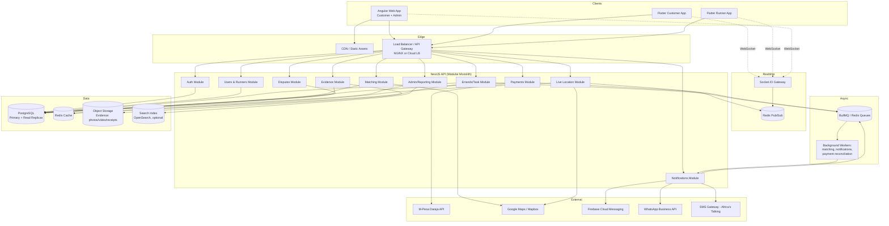
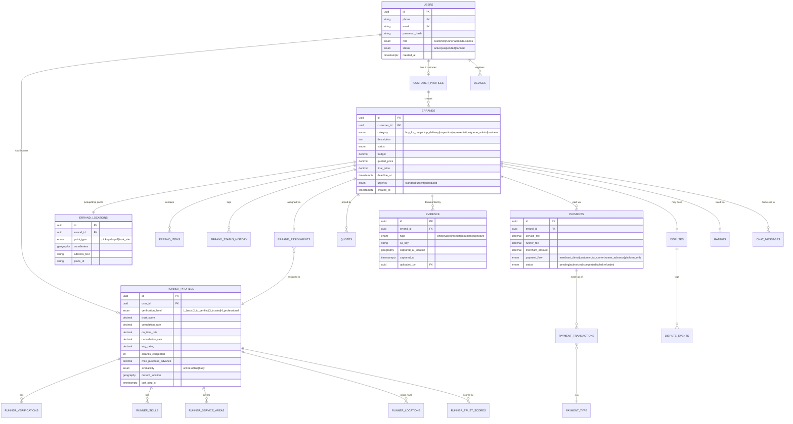
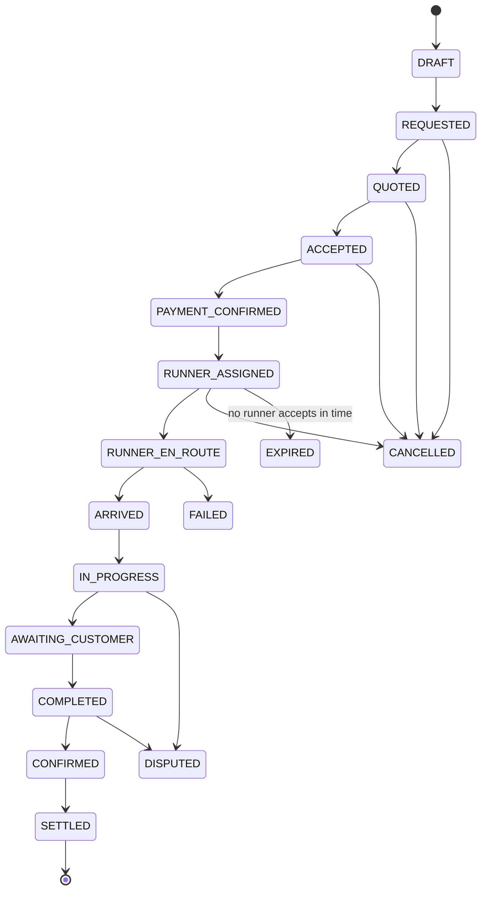
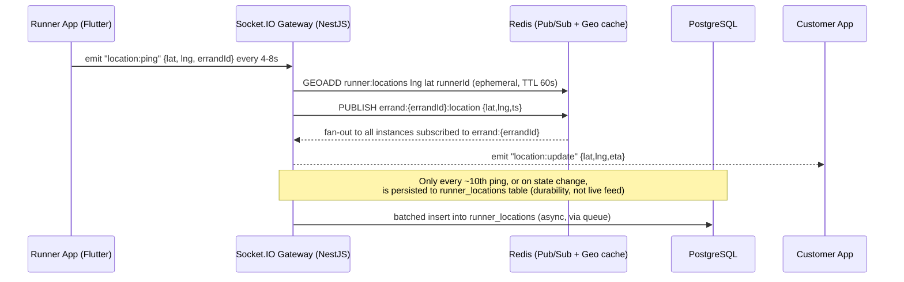
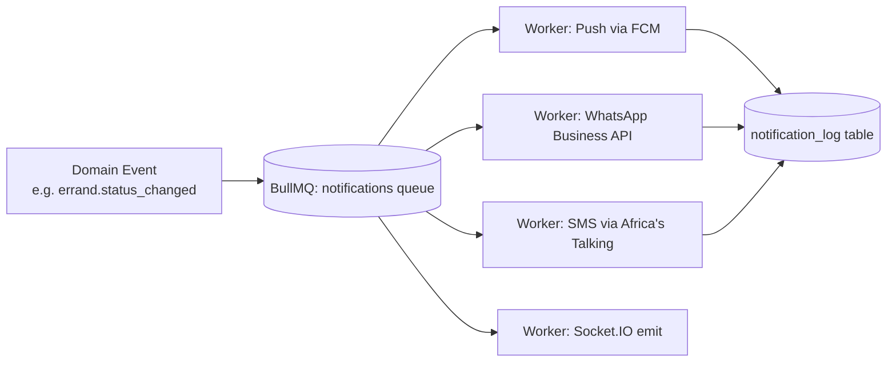
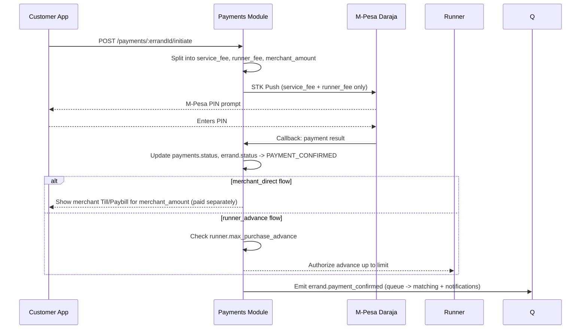
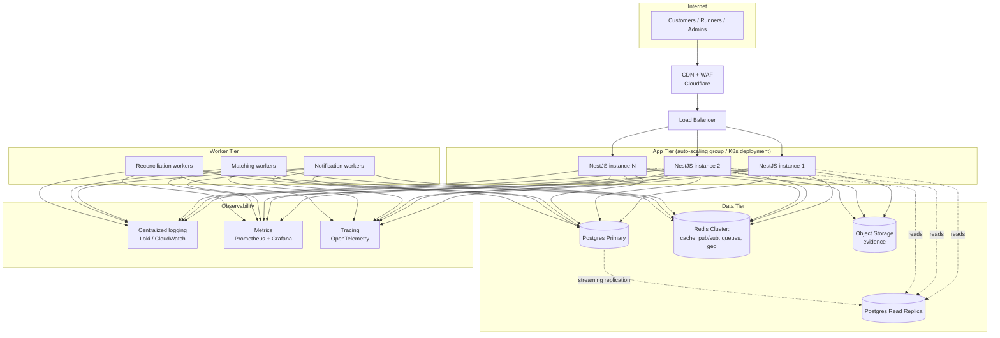

# Nitume — System Design

**Stack:** NestJS (API) · Angular (Web) · Flutter (iOS/Android — Customer & Runner apps) · PostgreSQL · Redis · Kafka/BullMQ · Socket.IO

This document translates the Nitume business plan into a concrete, buildable architecture: services, data model, real-time location/notifications, maps integration, and how the system scales.

---

## 1. Architecture Overview

Nitume starts as a **modular monolith** in NestJS — one deployable API split into strict internal modules — not microservices. At MVP scale (hundreds–low thousands of tasks/day) microservices add operational cost without a matching benefit. The modular boundaries are drawn so that any module (Payments, Location, Notifications) can be **peeled out into its own service later** without a rewrite, once volume justifies it (Section 9 covers exactly when/how).



**Why this shape:**
- **One API, many modules** keeps deployment, transactions and local development simple while the business is still discovering its shape.
- **Socket.IO + Redis Pub/Sub** handles everything "live": Runner GPS pings, task status changes, chat, arrival alerts — without polling.
- **BullMQ (Redis-backed queues)** handles anything that shouldn't block an HTTP request: sending notifications, running the matching algorithm, reconciling payments, generating reports.
- **PostgreSQL with read replicas** is the system of record; **Redis** is purely for speed (caching, live location, rate limiting, pub/sub) and is never the source of truth for anything financial.

---

## 2. Domain Data Model

### 2.1 Entity-Relationship Diagram



### 2.2 Notes on Key Tables

- **`runner_profiles.current_location`** is a PostGIS `geography(Point, 4326)` column, updated on every location ping *only for the summary/last-known value* — the high-frequency raw ping stream lives in Redis (Section 4), not Postgres, to avoid write-amplifying the primary database.
- **`errand_status_history`** is append-only — never update a row, always insert the next state. This is what powers both the customer-facing timeline and dispute resolution evidence.
- **`payments`** never stores a "customer purchase money held by Nitume" balance — by design (per the business plan), the `merchant_amount` field exists for *accounting visibility* only; actual settlement of that amount is between customer and merchant, or is a documented Runner advance capped by `runner_profiles.max_purchase_advance`.
- Use **PostGIS** (`CREATE EXTENSION postgis`) for all geo columns and queries — `ST_DWithin`, `ST_Distance` power Runner search radius and matching.

### 2.3 Indexing Strategy

| Table | Index | Purpose |
|---|---|---|
| `errands` | `(status, category, created_at)` | Admin/ops dashboards, matching queue |
| `runner_profiles` | GiST index on `current_location` | Radius search for nearby Runners |
| `errand_status_history` | `(errand_id, created_at)` | Timeline reconstruction |
| `payments` | `(errand_id)`, `(status, created_at)` | Reconciliation jobs |
| `evidence` | `(errand_id, type)` | Fetching evidence by task |
| `users` | unique `(phone)`, unique `(email)` | Auth lookups |

---

## 3. NestJS Backend Architecture

### 3.1 Module Breakdown

```
src/
├── auth/                # JWT auth, OTP (phone), refresh tokens, RBAC guards
├── users/                # User accounts, roles
├── runners/              # Runner profiles, verification, skills, service areas
├── customers/            # Customer profiles, saved addresses, recurring tasks
├── errands/               # Task CRUD, category rules, state machine
├── matching/              # Runner search & assignment algorithm
├── pricing/                # Quote engine (base + distance + urgency + complexity)
├── payments/               # Payment orchestration (service/runner/merchant flows)
├── mpesa/                   # Daraja STK Push, C2B/B2C callbacks
├── location/                 # Live GPS ingestion, geofencing, ETA
├── notifications/              # Push/SMS/WhatsApp/email dispatch
├── evidence/                    # Upload handling, S3 signed URLs
├── disputes/                     # Dispute workflow & evidence review
├── ratings/                       # Post-task ratings/reviews
├── chat/                           # In-task customer↔runner messaging
├── admin/                           # Ops dashboard endpoints, reporting
├── realtime/                        # Socket.IO gateway(s)
├── common/                          # Guards, interceptors, pipes, decorators
└── infra/                           # Config, health checks, logging, queues
```

Each module exposes a small public interface (its service) and keeps its repository/entities private — other modules only call through the service, never reach into another module's database access directly. This is what makes it safe to later extract, say, `payments/` into its own microservice.

### 3.2 API Design (REST, versioned `/api/v1`)

| Resource | Key endpoints |
|---|---|
| Auth | `POST /auth/register`, `POST /auth/otp/request`, `POST /auth/otp/verify`, `POST /auth/refresh` |
| Errands | `POST /errands`, `GET /errands/:id`, `PATCH /errands/:id/status`, `GET /errands?filter=` |
| Matching | `POST /errands/:id/quote`, `POST /errands/:id/assign`, `POST /errands/:id/accept` (Runner) |
| Location | `POST /location/ping` (Runner, high-frequency), `GET /errands/:id/tracking` |
| Payments | `POST /payments/:errandId/initiate`, `POST /payments/mpesa/callback`, `POST /payments/:id/authorize-change` |
| Evidence | `POST /evidence/:errandId/upload-url`, `POST /evidence/:errandId/confirm` |
| Disputes | `POST /disputes`, `GET /disputes/:id`, `POST /disputes/:id/resolve` (admin) |
| Runners | `POST /runners/verify`, `PATCH /runners/availability`, `GET /runners/:id/profile` |
| Admin | `GET /admin/dashboard`, `GET /admin/errands/live-map`, `GET /admin/reports/*` |

Design conventions: **cursor-based pagination** on list endpoints (not offset — offset pagination degrades badly at scale), **idempotency keys** on payment-initiating endpoints, **optimistic concurrency** (a `version` column) on `errands` to prevent double-assignment race conditions.

### 3.3 Task State Machine (enforced in `errands` module)



Implemented as a small explicit transition table in code (not a generic state-machine library at MVP size) — each transition validates the actor (customer/runner/admin/system), writes an `errand_status_history` row, and emits a domain event (`errand.status_changed`) that the Notifications and Realtime modules subscribe to.

### 3.4 Matching Algorithm (v1 → v2)

**v1 (MVP, semi-automated):** candidate Runner list generated by a PostGIS radius query, ranked by a weighted score, and offered to admin for one-click assignment (or auto-offered to the top Runner with a 90-second accept window, falling through to the next).

```
score = (1 / distance_km) * w1
      + trust_score          * w2
      + skill_match(0/1)     * w3
      + availability(0/1)    * w4
      - current_active_load  * w5
```

**v2 (post-MVP, automated):** same scoring function run as a background job the moment a task reaches `PAYMENT_CONFIRMED`, offering to the top 3 Runners in parallel (first to accept wins), with weights tuned from observed acceptance/completion data rather than guessed constants.

---

## 4. Live Location & Real-Time Layer

This is the part that most needs a deliberate design, since it's the highest-frequency, highest-volume traffic in the system.

### 4.1 Why Socket.IO + Redis, not raw WebSockets or polling

- **Polling** (customer app asking "where's my Runner?" every few seconds) wastes battery and bandwidth and doesn't scale linearly.
- **Socket.IO** gives us rooms (one room per `errand_id`), automatic reconnection/fallback, and a mature NestJS adapter (`@nestjs/websockets` + `@nestjs/platform-socket.io`).
- **Redis adapter for Socket.IO** (`socket.io-redis-adapter`) is what makes this scale horizontally: when the API runs on multiple instances, a location ping received on instance A needs to reach a customer socket connected to instance B. Redis Pub/Sub is the backbone that makes multi-instance Socket.IO work correctly.

### 4.2 Location Flow



Key decisions:
- **Runner app throttles GPS pings** client-side (4–8 second interval, or distance-based: only send if moved >15m) to save battery and reduce load — this is a Flutter-side `Geolocator` config, not something the backend can fix after the fact.
- **Redis GEO commands** (`GEOADD`, `GEORADIUS`) double as the live location cache *and* feed the matching module's "find nearby available Runners" queries — much cheaper than hitting PostGIS for every matching attempt.
- **Postgres only gets a sampled trail**, not every raw ping — full fidelity live tracking lives in Redis/the socket layer and is inherently ephemeral, which is the right trade-off (nobody needs GPS-ping-level history six months later; they need the evidence timeline in Section 2.2, which is a different, much lower-frequency table).
- **Socket rooms**: `errand:{errandId}` (customer + assigned runner + any admin watching), `runner:{runnerId}:status` (that Runner's own app, for job offers), `admin:live-map` (ops dashboard, subscribes to all active errands in a city).

### 4.3 Geofencing / Arrival Detection

When a Runner's live coordinates enter a radius (e.g. 100m) around an `errand_locations` point, the Location module auto-fires the `ARRIVED` status transition (with a manual override available in the Runner app in case GPS is inaccurate indoors). Implemented as a check inside the location-ping handler using `ST_DWithin`, not a separate polling job.

### 4.4 Live Notifications

| Trigger | Channel(s) | Who |
|---|---|---|
| Task requested / quoted | Push + in-app | Customer |
| Runner assigned | Push + WhatsApp | Customer |
| Runner en route / ETA update | Socket event (silent, updates map) | Customer |
| Runner arrived | Push | Customer |
| New job offer | Push (high priority) + Socket event | Runner |
| Price-change authorization needed | Push + Socket (blocking modal) | Customer |
| Evidence uploaded | Socket event (live timeline update) | Customer |
| Task completed | Push + WhatsApp | Customer |
| Payment confirmed/failed | Push | Customer & Runner |
| Dispute opened/resolved | Push + email | Both parties |

**Delivery pattern:** every notification-worthy domain event is published to a `notifications` BullMQ queue (not sent inline in the request/response cycle). A worker pool consumes the queue and fans out to the right channel(s) per user preference, with retries and dead-letter handling for failed sends (e.g. FCM token expired → mark device stale, don't retry forever).



A `notification_log` table records every send attempt (channel, status, provider response) — essential for debugging "customer says they never got notified."

---

## 5. Maps Integration

| Use case | Approach |
|---|---|
| Address autocomplete at task creation | Google Places Autocomplete API (Angular: `@angular/google-maps` / JS API; Flutter: `google_maps_flutter` + `google_place` or Places SDK) |
| Live tracking map (customer view) | Google Maps SDK, marker updated via Socket.IO `location:update` events — **do not** re-render the whole map, just animate the marker position |
| Runner navigation | Deep-link into Google Maps / Waze turn-by-turn (`geo:` / `google.navigation:` URIs) rather than building in-app turn-by-turn — not worth building ourselves at this stage |
| Distance/ETA for pricing | Google Distance Matrix API (server-side, cached per route pair for a few minutes to control API cost) |
| Admin live ops map | Google Maps JS API on the Angular admin dashboard, showing all active Runners/errands in a city, fed by the `admin:live-map` socket room |
| Geofencing (arrival) | PostGIS `ST_DWithin` server-side (Section 4.3) — cheap and doesn't depend on a maps vendor |

**Cost control:** Distance Matrix and Places Autocomplete are the expensive Google Maps APIs. Cache autocomplete results per session, debounce input (300ms), and cache distance-matrix lookups for common route pairs (e.g. "CBD → Kilimani") for a short TTL in Redis, since task pricing doesn't need per-second freshness.

---

## 6. Payments Orchestration

Implements the three-flow model from the business plan (service fee / runner fee / merchant payment) as explicit, separate transactions — never a single "charge the customer the total" call that then needs to be manually split.



- **M-Pesa integration**: STK Push (Lipa Na M-Pesa Online) for customer-initiated payments; B2C API for Runner payouts; all callbacks land on a dedicated `/payments/mpesa/callback` endpoint that is idempotent (Daraja can retry callbacks) and verified against Safaricom's IP allowlist/signature.
- **Payouts to Runners** are batched (e.g. daily or on-demand above a threshold) via B2C, not instant per-task, to control transaction fees — shown transparently in the Runner app as "available balance" vs "paid out."
- **Reconciliation worker** runs periodically to compare `payments` records against Daraja transaction reports and flags mismatches for finance review — this is the safety net that makes "we don't hold customer purchase money" operationally trustworthy.
- **No internal wallet** at MVP, per the business plan — `payments` and `payment_transactions` are a ledger of *events*, not a stored-balance system.

---

## 7. Frontend Architecture

### 7.1 Angular (Web)

```
apps/web/src/app/
├── core/                # Auth guards, interceptors (JWT refresh), API client services
├── shared/               # Reusable UI components, pipes, directives
├── features/
│   ├── customer/          # Task creation wizard, tracking, history, ratings
│   ├── business/            # B2B dashboard, bulk task upload, reporting
│   └── admin/                 # Ops dashboard, live map, disputes, verification queue
├── state/                       # NgRx store (or lightweight signals-based state)
└── realtime/                      # Socket.IO client service, shared across features
```

- **State management:** NgRx (or Angular signals + a thin service layer for smaller scope) for task status and live location, since multiple components (map, timeline, status banner) need to react to the same socket-driven state.
- **Live map component:** wraps `@angular/google-maps`, subscribes to the realtime service, animates marker position rather than re-rendering — critical for a smooth "watch your Runner move" experience.
- **Admin live-ops view** is the highest-value Angular screen early on, since Section 11 of the business plan explicitly relies on heavy manual oversight during MVP — build this *before* polishing the customer self-serve flow.
- **Lazy-loaded feature modules** per route (`customer`, `business`, `admin`) to keep initial bundle size down.

### 7.2 Flutter (Customer App & Runner App)

Two apps, one shared package, per the business plan's stack choice:

```
packages/
├── nitume_core/            # Shared: API client (Dio), models, auth, socket client,
│                            # design tokens, push notification setup
apps/
├── customer_app/            # Task creation, tracking, payments, history, chat
└── runner_app/                # Job offers, navigation handoff, status updates,
                                 # evidence capture (camera), earnings, availability toggle
```

- **State management:** Riverpod (or Bloc) — Riverpod recommended for cleaner handling of streams (location updates, job-offer streams) via `StreamProvider`.
- **Background location (Runner app):** `geolocator` + a foreground service (Android) / background location mode (iOS) so pings continue while the app is backgrounded during an active errand — with a clear in-app disclosure and OS-level permission flow, and pings **stop automatically** the moment the Runner goes offline or the task ends (battery + privacy).
- **Camera/evidence capture:** native camera plugin with **immediate upload** to a signed S3 URL (Evidence module issues short-lived pre-signed URLs) rather than storing large files locally and batching later, so evidence timestamps stay trustworthy.
- **Socket client:** a single persistent connection per app session, reconnecting with backoff; job offers and location updates share the connection but different event namespaces/rooms.
- **Push notifications:** Firebase Cloud Messaging for both platforms, deep-linking a tapped notification straight into the relevant errand screen.
- **Offline handling:** Runner app queues status updates (e.g. "arrived", "evidence captured") locally and syncs when connectivity returns — Kenyan mobile data can be patchy inside buildings/basements where inspections often happen.

---

## 8. Infrastructure & Deployment



- **Containerized** (Docker) from day one; orchestrated with either a managed container service (ECS/Cloud Run) at MVP or Kubernetes once the team needs finer-grained autoscaling and multi-service topology (Section 9).
- **CI/CD:** GitHub Actions — lint/test/build on PR, deploy to staging on merge to `main`, manual promotion to production. Separate pipelines for API, Angular web, and each Flutter app (with Fastlane for store deployment).
- **Environments:** `dev` → `staging` → `production`, with staging running against a sanitized data snapshot and M-Pesa sandbox credentials.
- **Secrets management:** never in code/env files committed to git — a secrets manager (AWS Secrets Manager / GCP Secret Manager / Doppler) injected at deploy time.
- **Database migrations:** managed through TypeORM/Prisma migrations, run as a separate CI step before new API versions roll out, with backward-compatible migrations (expand/contract pattern) so old and new API instances can run simultaneously during a rolling deploy.

---

## 9. Scaling Strategy

The design above already anticipates scale; this section makes explicit **what breaks first and what to do about it**, in order.

| Bottleneck (in likely order of appearance) | Symptom | Fix |
|---|---|---|
| Single Postgres instance under read load (admin dashboards, matching queries) | Slow queries during peak hours | Add read replica(s); route reporting/admin reads to replica |
| Socket.IO on a single instance | Real-time features degrade as concurrent connections grow | Horizontal scale API instances + Redis adapter (already in base design, Section 4.1) |
| Synchronous notification sending inside request handlers | Slow API responses, dropped notifications on failure | Already queued via BullMQ (Section 4.4) — verify worker pool scales independently of API pods |
| Distance Matrix / Places API cost & latency | Rising Google Maps bill, slower quote generation | Aggressive caching (Section 5), consider self-hosted OSRM for distance calculation once volume is high |
| Matching algorithm run synchronously per request | Slow task creation at busy times | Move matching to an async worker (v2 in Section 3.4), return "finding a runner" state immediately |
| Hot rows on `errands`/`payments` during concurrent writes | Lock contention at high volume in one city | Partition heavy tables (e.g. `errand_status_history`, `runner_locations` samples) by month; ensure row-level locking via optimistic concurrency (Section 3.2) rather than table locks |
| One region only | Latency for expansion cities, single point of failure | Multi-AZ deployment first (cheap, high value); multi-region only if/when expanding beyond Kenya |
| Modular monolith becomes a deploy bottleneck (one team change blocks another) | Slower release cycles as team grows | Extract the highest-traffic, most independent modules first — **Location** and **Notifications** are the best early candidates for extraction into standalone services, since they're already decoupled via Redis/queues in this design |
| Search/reporting queries slow down Postgres | Admin analytics degrade | Introduce OpenSearch/Elasticsearch fed by CDC (e.g. Debezium) from Postgres for heavy read/reporting workloads, keeping Postgres focused on transactional writes |

**General principles baked into the design from the start** (so scaling later is additive, not a rewrite):
- Stateless API instances — session state lives in Redis/JWT, not instance memory, so any instance can serve any request.
- Every write path that isn't strictly synchronous (notifications, matching, reconciliation, reporting) already goes through a queue.
- Real-time fan-out already goes through Redis Pub/Sub, not in-process event emitters, so it's multi-instance-safe from day one.
- Read/write separation is designed in (replica-ready) even if only one Postgres instance is running at MVP.

---

## 10. Security & Compliance Notes

- **Auth:** JWT access tokens (short-lived, ~15 min) + refresh tokens (rotated, stored hashed); OTP-based phone verification for account creation (critical in a market where email is less universal than phone numbers).
- **RBAC:** guards at the NestJS controller level for `customer` / `runner` / `admin` / `business` roles; row-level checks (e.g. a customer can only fetch *their* errand) enforced in service methods, not trusted to the client.
- **PII handling:** ID documents and verification photos stored in a restricted S3 bucket (separate from general evidence), access logged, never exposed directly to other Runners/customers per Section 5.2 of the business plan ("avoid exposing unnecessary personal information").
- **Payments:** no card/M-Pesa credentials ever touch Nitume's servers directly — Daraja handles the PIN entry flow; Nitume only receives tokens/callbacks.
- **Rate limiting:** per-IP and per-user on auth and payment-initiation endpoints (Redis-backed, e.g. `@nestjs/throttler`) to blunt abuse/fraud attempts.
- **Audit trail:** `errand_status_history`, `payment_transactions` and `notification_log` are append-only, giving a defensible record for dispute resolution and any future regulatory inquiry.

---

## 11. Build Sequencing (maps onto the business plan's 30/90-day roadmap)

1. **Foundation:** Auth, Users, Runners (basic verification), Errands (CRUD + state machine), Postgres schema, admin dashboard shell.
2. **Core loop:** Pricing/quotes, manual matching via admin, M-Pesa STK Push, evidence upload, basic push notifications.
3. **Live layer:** Socket.IO gateway, Runner location pings, live tracking map (Angular + Flutter), geofenced arrival detection.
4. **Automation:** Automated matching (v2), full notification fan-out (WhatsApp/SMS/push), reconciliation worker, disputes workflow.
5. **Scale-readiness:** Read replica, Redis cluster, containerized multi-instance deploy, observability stack, load testing before city #2 launch.

This sequencing deliberately builds the "live" features (Section 4) right after the core transactional loop works end-to-end manually — matching your requirement for maps, live location and live notifications, without trying to build the fully automated, fully scaled system before there's real usage data to tune it against.
